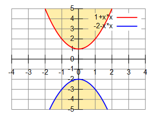
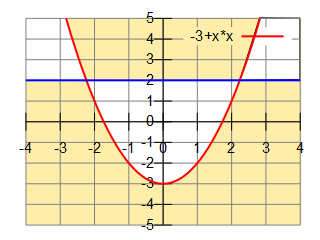
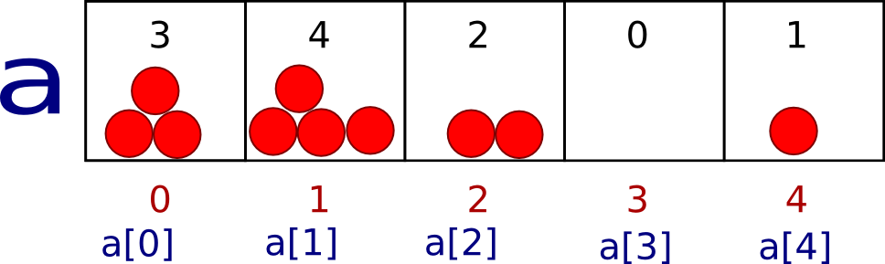
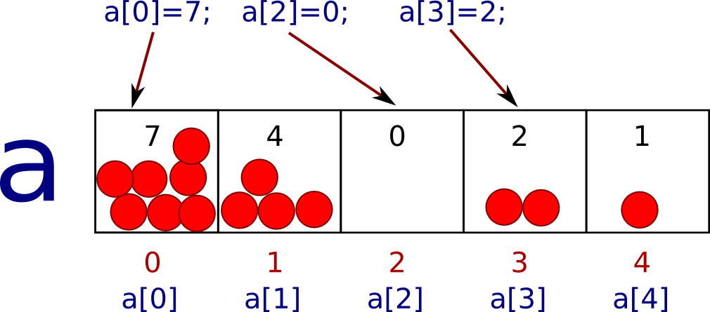
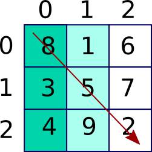
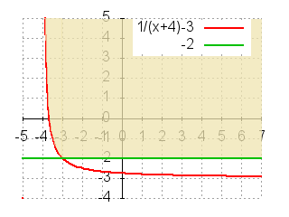

# E - ETA

## Сложить часы и минуты
Поезд отправляется в h1:m1, время в пути h2:m2. Во сколько прибывает поезд?

## Входные данные
Через : с лидирующими нулями по одной на каждой строке:<br>
h1:m1 - время отправления поезда<br>
h2:m2 - время в пути

## Выходные данные
Через : с лидирующими нулями<br>
hh:mm - время прибытия поезда

## Примеры
Вход | Выход
--- | ---
12:01<br>17:56 | 05:57

## [Решение](E.c)

---

# F - float

## Замечательная точка треугольника

Даны координаты вершин треугольника A(x1, y1), B(x2, y2), C(x3, y3). Вычислить координаты точки пересечения медиан треугольника M(xm, ym).

## Входные данные
Шесть вещественных чисел x1, y1, x2, y2, x3, y3, являющиеся координатами вершин треугольника, в указанном порядке, через пробел и без запятых.

## Выходные данные
Два вещественных числа через пробел xm и ym, являющиеся координатами точки пересечения медиан треугольника.

*Подсказка: эта замечательная точка, вероятно, как-то связана с центром масс данной фигуры.*

Для вычислений использовать числа двойной точности.

## Примеры
Вход | Выход
--- | ---
0 0 0 7 5 0 | 1.66667 2.33333
1 1 26 1 10 13 | 12.3333 5
3.5 4.5 5 3 7 3 | 5.16667 3.5

## [Решение](F.c)

---

# G - graph of functions

## Принадлежность области - парабола
По данным x и y координатам точки напечатайте - принадлежит точка к указанной области (НЕ включая границы) или нет.



## Входные данные
Два числа с плавающей точкой через пробел - x и y координаты точки

## Выходные данные
YES, если точка принадлежит области вместе с границей, NO - если не принадлежит

## Примеры
Вход | Выход
--- | ---
1.5 -5.0 | YES

## [Решение](G.c)

---

# I - if

## Принадлежность области - парабола

По данным x и y координатам точки напечатайте - принадлежит точка к указанной области или нет. В связи с ограниченностью точности представления действительных чисел тестов на границе областей нет.



## Входные данные
Два числа с плавающей точкой через пробел - x и y координаты точки

## Выходные данные
YES, если точка принадлежит области, NO - если не принадлежит

## Примеры
Вход | Выход
--- | ---
1.5 4.0 | YES

## [Решение](I.c)

---

# J - Jeopardy!

## Сколько раз встретилось число
Найти, сколько раз встретилось указанное число в последовательности чисел.

## Входные данные
Целое число K. Целое число 0 < N < 1000. Затем N целых чисел.

## Выходные данные
Сколько раз встретилось число К в последовательности чисел.

## Примеры

Вход | Выход
--- | ---
7<br>3<br>7 2 7|2

## [Решение](J.c)

---

# K - binary

## Сколько 1 в двоичной записи числа
Найти, сколько единиц содержит двоичная запись числа.

## Входные данные
Целое неотрицательное число K.

## Выходные данные
Сколько единиц содержит двоичная запись числа.

## Примеры
Вход | Выход
--- | ---
5|2

## [Решение](K.c)

---

# L - differnce

## Суммы четных и нечетных мест
Дана последовательность чисел. Найти разность суммы чисел, стоящих на четных и стоящих на нечетных местах. (нумерация начинается с нуля)

## Входные данные
Целое число 0 < N < 1000. Затем N целых чисел.

## Выходные данные
Разность сумм.

## Примеры
Вход | Выход
--- | ---
7<br>7 2 9 1 2 3 10|22

*Пояснение: (7+9+2+10) - (2+1+3) = 28 - 6 = 22*

## [Решение](L.c)

---

# M - Внук Боначчи

## Последовательность-3
n-тый член последовательности задан как F(n) = F(n-1)+F(n-2)+F(n-3), F(0)=F(1)=F(2)=1. Найти n-тый член последовательности.

## Входные данные
Натуральное число 0 < N ≤ 30.

## Выходные данные
N-тый член последовательности.

## Примеры
Вход|Выход
---|---
6|17

*Пояснение: в последовательности 1 1 1 3 5 9 17 (6-ым членом является число 17)*

## [Решение](M.c)

---

# N - Делимость

## Делится на 3?
Дано натуральное число n < 101000. Напечатать YES, если число делится на 3, иначе напечатать NO. Число делится на 3, если сумма всех его цифр делится на 3.

## Входные данные
Натуральное число n.

## Выходные данные
YES если число делится на 3. Иначе NO.

## Примеры
Вход|Выход
---|---
123|YES
123000001|NO
999999999999999966666666666666666666633333333333333333|YES

## [Решение](N.c)

---

# O - Скобочки

## Скобочки
Некоторые скобочные структуры правильные, другие — неправильные. Ваша задача — определить правильная ли скобочная структура.

## Входные данные
Слово в алфавите из двух круглых скобочек ( и ). Длина слова меньше 4001

## Выходные данные
Либо NO, либо YES

## Примеры
Вход|Выход
---|---
()|YES
)(|NO
()(())()|YES

*Подсказка: конец последовательности - любой символ, кроме скобочек (или конец файла)*

## [Решение](O.c)

---

# P - Реверс

## Число в обратном порядке
Выведите число, состоящее из цифр данного числа x в обратном порядке. Ведущие нули выводить не нужно.

## Входные данные
Целое положительное N < (2^31)-1 (тесты подобраны так, что все промежуточные вычисления можно выполнять в int)

## Выходные данные
Число в обратном порядке без ведущих нулей.

## Примеры
Вход|Выход
---|---
123|321
2100|12

## [Решение](P.c)

---

# Q - Array

## Массив - обращение к элементам
Большая коробка поделена на 5 одинаковых ячеек. Коробка называется a. Все ячейки имеют номер: от 0 до 4. В ячейки положили шарики:



В каждую ячейку можно положить число шариков:



## Задача
Написать программу, которая печатает количество шариков в каждой ячейке.

```c
#include <stdio.h>

int main(){
    int a[5];           // коробка с ячейками


    scanf("%d", &a[0]); // получить число шариков в ячейке с номером 0
    scanf("%d", &a[1]); // получить число шариков в ячейке с номером 1
    scanf("%d", &a[2]); // получить число шариков в ячейке с номером 2

    a[3] = 7;           // присвоить 7 ячейке с номером 3

                        // присвоить число шариков из ячейки с номером 0 в
                        // ячейку с номером 4
    a[4] = a[0];

    printf("%d\n", a[0]); // печать количества шариков в 0 ячейке

    return 0;
}
```

Изменить программу. Надо напечатать 3 числа: количество шариков в ячейках с номерами 0, 3, 4.

## Входные данные
3 целых числa через пробел

## Выходные данные
3 целых числа (по 1 числу на строку)

## Примеры
Вход|Выход
---|---
5 3 100|5<br>7<br>5

## [Решение](Q.c)

---

# R - Repeat

## Дважды напечатанная последовательность
Напечатайте дважды введенную последовательность чисел

## Входные данные
Целое число 0 < N < 1000. Затем N чисел, по модулю не превышающих 30000, через пробел.

## Выходные данные
Входная последовательноть. Еще раз входная последовательность.

## Примеры
Вход|Выход
---|---
3<br>2 17 5|2 17 5 2 17 5

## [Решение](R.c)

---

# T - Test of 2D

## Задача T: Test of 2D
Написать программу, которая:
1) В таблицу целых чисел 3 строки на 3 столбца (3Х3) получить все числа.
2) Вычислить сумму чисел в диагонали (как на рисунке).
3) Напечатать сумму.



## Входные данные
3 строки по 3 целых числа

## Выходные данные
Сумма чисел из диагонали

## Примеры
Вход|Выход
---|---
8 1 6<br>3 5 7<br>4 9 2|15

## [Решение](T.c)

---

# V - Verify point

## Функция принадлежности области - гипербола
Реализуйте функцию с координатами точки, которая возвращает 0, если точка лежит вне указанной области, и любое другое значение, если точка принадлежит области (включая ее границы).

int **func_hyper**(float x, float y);

Функцию main реализовывать НЕ нужно. Проверку корректности аргументов не делать.



## [Решение](V.c)

---

# W

## НОД нескольких чисел
Напишите функцию **unsigned int nod(unsigned int a, unsigned int b)**, возвращающую наибольший общий делитель аргументов a и b.

Функцию main реализовывать НЕ нужно.

Проверку корректности аргументов можно не делать.

## [Решение](W.c)

---

# X

## Fact
Напишите функцию **unsigned long long fact(unsigned long long n)**, которая возвращает n! (n факториал). n! = n*(n-1)! где 0!=1.

Функцию main реализовывать НЕ нужно.

Проверку корректности аргументов можно не делать.

## [Решение](X.c)

---

# b - передаем адрес в функцию

## Передача параметров в функцию
Реализуйте функцию, **int foo2 (int * px, int * py);** которая:
- принимает адреса двух переменных,
- возвращает сумму значений этих переменных,
- увеличивает на 1 значение первой переменной,
- уменьшает на 1 значение второй переменной,
- печатает возвращаемое значение и измененные значения переменных по формату "foo2 : res=%d x=%d y=%d\n"

**В проверяющую систему посылать только реализацию требуемой функции.**

## [Решение](b.c)

---

# g - Отрезок

## Line X with pointer
Отрезок на оси Х задан координатами концов start и finish.
Для описания отрезка на оси Х создана структура Line.
```c
struct Line {      // название структуры
   int start;      // поля структуры
   int finish;
};
```
Нужно уметь:
1) печатать координаты концов отрезка;
2) считывать координаты концов отрезка;
3) вычислять длину отрезка;
4) передвигать отрезок по оси Х.
Для этого объявим структуру Line и реализуем функции:

Функция|Что делает
---|---
void readLine (struct Line * pa);|читает отрезок
void printLine (struct Line a);|печатает отрезок
int lengthLine (struct Line a);|длина отрезка
void moveLine (struct Line * pa, int dx);|двигает отрезок на dx

**Когда функция НЕ должна изменять отрезок, передадим отрезок ПО ЗНАЧЕНИЮ как struct Line**

**Когда функция должна изменять отрезок, передадим АДРЕС переменной как struct Line\***

```c
/* Отрезок на оси Х. Научимся его читать, печатать и сдвигать на dx */
#include <stdio.h>

struct Line {      // название структуры
   int start;      // поля структуры
   int finish;
};
void readLine(struct Line * pa);          // читает отрезок
void printLine(struct Line a);             // печатает отрезок
int lengthLine(struct Line a);             // длина отрезка
void moveLine(struct Line * pa, int dx);  // двигает отрезок на dx

int main() {
    struct Line a;           // объявили переменную a типа struct Line
    int dx;
    readLine(&a);            // в функцию передается выражение типа struct Line *
    scanf("%d", &dx);        // в функцию передается выражение типа int *

    printf("length = %d\n", lengthLine(a));
    printLine(a);           // передаем a по значению
    moveLine(&a, dx);       // передаем a по адресу, dx по значению
    printLine(a);
    return 0;
}
void readLine(struct Line * pa) {
    // функция должна изменить значение переданного объекта,
    // поэтму объект в функцию передается по адресу
    scanf("%d%d", &(pa->start), &(pa->finish));
    // функция ничего не возвращает, так как прочитанные числа положила по адресам pa->start и pa->finish

    // Измените функцию так, чтобы ВСЕГДА значение finish было больше или равно start
}
void printLine(struct Line a) {
    // функция НЕ должна изменить значение переданного объекта,
    // поэтму объект в функцию можно передать по значению
    printf("(%d, %d)\n", a.start, a.finish);
}
int lengthLine(struct Line a) {
    return a.finish - a.start;
}
void moveLine(struct Line * pa, int dx) {
    // функция должна изменить значение переданного объекта,
    // поэтму объект в функцию передается по адресу
    pa->start = pa->start + dx;
    pa->finish += dx;

    // функция ничего не возвращает
}
```

Написать и отладить программу, которая читает координаты отрезка и на сколько нужно его сдвинуть. Печатает длину отрезка и координаты отрезка после сдвига.

# Входные данные
3 целых числа - координаты начала и конца отрезка, на сколько сдвинуть отрезок.

# Выходные данные
Длина отрезка на одной строке

Координаты отрезка после сдвига (через пробел) на другой строке.

# Примеры
Вход|Выход
---|---
1 10 3|9<br>4 13
1 10 -3|9<br>-2 7
10 2 -6|8<br>-4 4

## [Решение](g_1.c)

---

# h - Плоскость

## Line XY with pointer
Отрезок на плоскости XY задан координатами концов start и finish.<br>
Точка на плоскости задана координатами х и y.<br>
Для описания точки на плоскости создана структура struct Point<br>
Для описания отрезка создана структура Line.<br>
Для описания направления сдвига создана структура struct Direction

```c
struct Direction {
    int x;                  // сдвиг по оси Х
    int y;                  // сдвиг по оси Y
};
struct Point {             // название структуры
    int x;                 // х координата точки
    int y;                 // y координата точки
};
struct Line {               // название структуры
   struct Point start;      // поля структуры
   struct Point finish;
};
```

Нужно уметь:
1) печатать координаты концов отрезка;
2) считывать координаты концов отрезка;
3) вычислять длину отрезка;
4) передвигать отрезок по оси X и по любому направлению.

Для этого объявим структуру Line и реализуем функции:

Функция|Что делает
---|---
void readLine (struct Line * pa);|читает отрезок
void printLine (struct Line a);|печатает отрезок
float lengthLine (struct Line a);|длина отрезка
void moveLineX (struct Line * pa, int dx);|двигает отрезок на dx
void moveLine (struct Line * pa, struct Direction d);|двигает отрезок на (dx, dy)

**Когда функция НЕ должна изменять отрезок, передадим отрезок ПО ЗНАЧЕНИЮ как struct Line**

**Когда функция должна изменять отрезок, передадим АДРЕС переменной как struct Line \***

```c
/* Отрезок на оси Х. Научимся его читать, печатать и сдвигать на dx */
#include <stdio.h>
#include <math.h>

struct Direction {
    int x;                  // сдвиг по оси Х
    int y;                  // сдвиг по оси Y
};
struct Point {             // название структуры
    int x;                 // х координата точки
    int y;                 // y координата точки
};
struct Line {               // название структуры
   struct Point start;      // поля структуры
   struct Point finish;
};

void readLine(struct Line * pa);          // читает отрезок
void printLine(struct Line a);             // печатает отрезок
float lengthLine(struct Line a);             // длина отрезка
void moveLineX(struct Line * pa, int dx);  // двигает отрезок на dx
void moveLine(struct Line * pa, struct Direction d);  // двигает отрезок на d

int main() {
    struct Line a;           // объявили переменную a типа struct Line
    struct Direction  d;

    readLine(&a);            // в функцию передается выражение типа struct Line *
    scanf("%d", &(d.x));    // в функцию передается выражение типа int *
    scanf("%d", &(d.y));    // в функцию передается выражение типа int *

    printf("length = %f\n", lengthLine(a));
    printLine(a);           // передаем a по значению

    moveLineX(&a, d.x);        // передаем a по адресу, d.x по значению
    printLine(a);

    moveLine(&a, d);            // передаем a по адресу, d по значению
    printLine(a);

    return 0;
}
void readPoint (struct Point * p) {
    scanf("%d%d", &(p->x), &(p->y));
}
void printPoint(struct Point p) {
    printf("(%d %d)", p.x, p.y);
}
void readLine(struct Line * pa) {
    // функция должна изменить значение переданного объекта,
    // поэтму объект в функцию передается по адресу
    readPoint( &(pa->start) );
    readPoint( &(pa->finish) );
}
void printLine(struct Line a) {
    // функция НЕ должна изменить значение переданного объекта,
    // поэтму объект в функцию можно передать по значению
    printPoint(a.start);
    printPoint(a.finish);
    printf("\n");
}
float lengthLine(struct Line a) {
    int dx = a.finish.x - a.start.x;
    int dy = a.finish.y - a.start.y;
    return sqrt(dx*dx + dy*dy);
}
void moveLineX(struct Line * pa, int dx) {
    // функция должна изменить значение переданного объекта,
    // поэтму объект в функцию передается по адресу
    pa->start.x = pa->start.x + dx;
    pa->finish.x += dx;
}
void moveLine(struct Line * pa, struct Direction d) {
    // тут нужно написать код
}
```

Написать и отладить программу, которая читает координаты отрезка и на сколько нужно его сдвинуть.
Печатает длину отрезка и координаты отрезка после сдвига.

## Входные данные
4 целых числа - координаты начала и конца отрезка x1 y1 x2 y2, на следующей строке величина сдвига по оси X и оси У

## Выходные данные
Длина отрезка на одной строке
Координаты отрезка после сдвига (через пробел) на другой строке.

## Примеры
Вход|Выход
---|---
3 0 0 4<br>1 2|5<br>4 2 1 6

## [Решение](h.c)

---

# i - max rect

## Struct Rect - 5
Дана структура, описывающая прямоугольник со сторонами, параллельными осям координат. Реализуйте функцию, max, возвращающую больший по площади прямоугольник. Если два прямоугольника имеют равные площади, возвратите любой из них.

```c
struct Rect * max(struct Rect * pa, struct Rect * pb);
```

Структура уже определена в программе:

```c
struct Rect {
    int x;        // верхняя левая точка, х-координата
    int y;        // верхняя левая точка, y-координата
    int width;    // ширина
    int height;   // высота
};
```

Функцию main реализовывать НЕ нужно.

## [Решение](i_1.c)

---

# l - Выборы в Средиземье

## Выборы в Средиземье
При подсчёте голосов на выборах в Средиземье произошло ЧП. По данным на сайте ЦИК, места в Волшебном совете получили те партии, которые не преодолели необходимый барьер, а те, которые преодолели - не получили. Председатель ЦИК Гэндальф считает, что в программное обеспечение вставил свои злые char'ы Саурон. Взломщик Бильбо Барсеточник говорил ему об уязвимости, позволяющей вставить в текст строку (с символами перевода строки в начале и конце), но Гэндальф сделал хотфикс, контролирующий количество точек с запятой в программе, и считал, что самое худшее - кто-то вставит матерный комментарий. Весь исходный код Гэндальф не хочет раскрывать по причинам сopyright'а, но показал Вам строку, которая стала работать неправильно:

```c
if((percents > barrier) == false) printf("You shall not pass!\n"); else
```

Продемонстрируйте Гэндальфу, какую строчку без точек с запятой на языке С можно вставить до переставшей работать так, чтобы произошло описываемое событие.

## [Решение](l_1.c)

---

# m - Символ

## Символы
После контакта с жителями системы Альдебарана удалось расшифровать их письменность. Они используют Aldebaran Space Code for Information Interchange. Считайте со стандартного ввода целое число и выведите ASCII-символ с таким кодом. Решите эту задачу с использованием только одной переменной типа int.

## Входные данные
Программа получает на вход целое число от 32 до 126.

## Выходные данные
ASCII-символ с кодом, равным этому числу

## Примеры
Вход|Выход
---|---
81|Q

## [Решение](m_1.c)

---

# n - Длина строки

## strlen

Для Альдебаранских компьютеров, на которых нет glibc, пришлось в срочном порядке разрабатывать аналог. Напишите функцию
```c
size_t my_strlen(const char *s);
```
которая работает так же, как стандартная функция языка С (то есть вычисляет длину строки).
Функцию main реализовывать НЕ нужно.

Проверку корректности аргументов не делать.

Справка:

```c
#include <string.h>
size_t strlen(const char *s);
```

Функция strlen() вычисляет длину строки s. Завершающий символ '\0'не учитывается.

Возвращает количество символов в строке s.

## [Решение](n_1.c)

---

# o - Яровизация Галактики

## Задача o: Яровизация Галактики
В процессе исполнения "закона Яровой" удалось перехватить переписку космических пиратов Межзвёздного Государства Альдебарана и Бетельгейзе (его деятельность запрещена в галактике Млечный путь). К сожалению, переписки оказалось очень много - более 100500 экзабайт. Поэтому процесс анализа нужно автоматизировать. Нужно написать программу, которая в конкретном письме найдёт определённые ключевые слова.

Напечатать YES, если в тексте есть слово **bomb**. Иначе напечатать NO.

*Подсказка: используйте функцию strcmp.*

## Входные данные
Строки слов только из маленьких латинских букв.

Символы, отличающиеся от маленьких латинских букв, разделяют слова

## Выходные данные
YES, если встретилось слово bomb, иначе NO

## Примеры
Вход|Выход
---|---
a high explosive bomb is one<br>that employs a process called detonation<br>to rapidly release its chemical energy|YES
the simplest and oldest type of bombs store energy<br>in the form of a low explosive|NO
mumbai also known as bombay is<br>the capital city of the indian state of maharashtra|NO
the seven islands that came to constitute<br>mumbai were home to communities of fishing colonies|NO
Nbomb|YES

## [Решение](o_1.c)

---