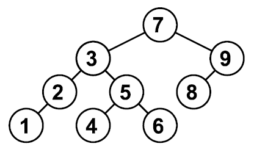

# tree_1 - add+print

## Бинарное дерево
Реализуйте структуру данных "бинарное дерево". Для этого при объявленной структуре

```c
typedef int Data;

struct Node {
    Data val;            // данные в узле
    struct Node * left;  // левый ребенок
    struct Node * right; // правый ребенок
};
```
где **val** - данные, хранящиеся в узле, **left**, **right** - указатели на левого и правого ребенка. NULL, если ребенка нет.

Реализуйте фукнции работы с бинарным деревом:

Функция|Что делает
---|---
struct Node * tree_add (struct Node * tree, Data x);|Добавляет узел со значением х в (под)дерево, корень которого tree. tree_add от tree!=NULL возвращает указатель на узел, от которого вызван (возможно, головной). tree_add от tree равным NULL создает лист и возвращает ссылку на созданный узел. Бинарное дерево достраивается рекурсивным спуском по дереву; на каждом шаге спуска выбирается соотвествующая левая или правая ветка (в зависимости от того, меньше х или больше значения val, хранящегося в текущем узле дерева), пока не найдется место для вставки новой вершины (т.е ссылка на нужную ветвь равна NULL). Новая вершина добавляется как лист дерева, т.е. указатели на дочерние вершины left и right равны NULL. Если элемент уже существует в дереве, добавлять его не надо. Балансировка дерева не производится.
void tree_print (struct Node * tree);|Обходит дерево в глубину слева направо, печатая значения val, хранящиеся в узлах, через пробел. Перевод строки не ставит.<br>Вызывает функцию печати левого поддерева, печатает значение в узле, вызывает функцию печати правого поддерева.

Функцию main реализовывать НЕ нужно.

## Примеры

```c
struct Node * tree = NULL;
tree = tree_add(tree, 7);
tree = tree_add(tree, 3);
tree = tree_add(tree, 2);
tree = tree_add(tree, 1);
tree = tree_add(tree, 9);
tree = tree_add(tree, 5);
tree = tree_add(tree, 4);
tree = tree_add(tree, 6);
tree = tree_add(tree, 8);
tree_print(tree); // напечатает 1 2 3 4 5 6 7 8 9
```

Пример соответствует дереву:



## [Решение](tree_1.c)

---

# tree_11 - add+print+destroy

Реализуйте структуру данных "бинарное дерево". Для этого при объявленной структуре

```c
typedef int Data;

struct Node {
    Data val;            // данные в узле
    struct Node * left;  // левый ребенок
    struct Node * right; // правый ребенок
};
```

где **val** - данные, хранящиеся в узле, **left**, **right** - указатели на левого и правого ребенка. NULL, если ребенка нет.

Реализуйте фукнции работы с бинарным деревом:
Функция|Что делает
---|---
struct Node * tree_add (struct Node * tree, Data x);|Добавляет узел со значением х в (под)дерево, корень которого tree. tree_add от tree!=NULL возвращает указатель на узел, от которого вызван (возможно, головной). tree_add от tree равным NULL создает лист и возвращает ссылку на созданный узел. Бинарное дерево достраивается рекурсивным спуском по дереву; на каждом шаге спуска выбирается соотвествующая левая или правая ветка (в зависимости от того, меньше х или больше значения val, хранящимся в текущем узле дерева), пока не найдется место для вставки новой вершины (т.е ссылка на нужную ветвь равна NULL). Новая вершина добавляется как лист дерева, т.е. указатели на дочерние вершины left и right равны NULL. Если элемент уже существует в дереве, добавлять его не надо. Балансировка дерева не производится.
void tree_print (struct Node * tree);|Обходит дерево в глубину слева направо, печатая значения val, хранящиеся в узлах, через пробел. Перевод строки не ставит.<br>Вызывает функцию печати левого поддерева, печатает значение в узле, вызывает функцию печати правого поддерева
void tree_destroy (struct Node * tree);|Освобождает динамическую память, используемую для хранения узла tree и его детей

Функцию main реализовывать НЕ нужно.

## Примеры

```c
struct Node * tree=NULL;
tree = tree_add(tree, 7);
tree = tree_add(tree, 3);
tree = tree_add(tree, 2);
tree = tree_add(tree, 1);
tree = tree_add(tree, 9);
tree = tree_add(tree, 5);
tree = tree_add(tree, 4);
tree = tree_add(tree, 6);
tree = tree_add(tree, 8);
tree_print(tree);   // напечатает 1 2 3 4 5 6 7 8 9
tree_destroy(tree);
```

Пример соответствует дереву:


## [Решение](tree_11.c)

---

# tree_2 - sort numbers

## Числа по возрастанию
Распечатайте последовательность натуральных чисел по возрастанию, печатая каждое число один раз. Для решения задачи используйте бинарное дерево.

## Входные данные
На вход программа получает последовательность натуральных чисел меньших 10000. Последовательность завершается числом 0, которое означает конец ввода, и печатать его не нужно.

## Выходные данные
Числа через пробел по возрастанию. Допустим лишний пробел в конце.

## Примеры

Вход|Выход
---|---
7 3 2 1 9 5 4 6 8 0|1 2 3 4 5 6 7 8 9

Пример соответствует дереву:


## [Решение](tree_2.c)

---

# tree_3-глубина дерева

## Высота дерева
Реализуйте бинарное дерево поиска для целых чисел. Программа получает на вход последовательность целых чисел и строит из них дерево. Элементы в деревья добавляются в соответствии с результатом поиска их места. Если элемент уже существует в дереве, добавлять его не надо. Балансировка дерева не производится.

## Входные данные
На вход программа получает последовательность натуральных чисел меньших 10000. Последовательность завершается числом 0, которое означает конец ввода, и добавлять его в дерево не надо.

## Выходные данные
Выведите единственное число – высоту получившегося дерева.

## Примеры

Вход|Выход
---|---
7 3 2 1 9 5 4 6 8 0|4

Пример соответствует дереву:


## [Решение](tree_3.c)
---

# tree_4 - печатаем листья

## Дерево - листья
Реализуйте бинарное дерево поиска для целых чисел. Программа получает на вход последовательность целых чисел и строит из них дерево. Элементы в деревья добавляются в соответствии с результатом поиска их места. Если элемент уже существует в дереве, добавлять его не надо. Балансировка дерева не производится.

## Входные данные
На вход программа получает последовательность натуральных чисел меньших 10000. Последовательность завершается числом 0, которое означает конец ввода, и добавлять его в дерево не надо.

## Выходные данные
Для полученного дерева выведите список всех листьев (вершин, не имеющих потомков) в порядке возрастания.

## Примеры

Вход|Выход
---|---
7 3 2 1 9 5 4 6 8 0|1 4 6 8

Пример соответствует дереву:


## [Решение](tree_4.c)

---

# tree_6 - частотный словарь

## Дерево - частотный словарь
По данной последовательности постройте дерево, запоминая для каждого элемента его значение и количество его повторений в последовательности.

## Входные данные
На вход программа получает последовательность натуральных чисел меньших 10000. Последовательность завершается числом 0, которое означает конец ввода, и добавлять его в дерево не надо.

## Выходные данные
Выведите на экран содержимое дерева в порядке возрастания, по одному элементу на строку. В каждой строке выводите значение элемента, затем, через пробел, укажите, сколько раз он встречается в исходной последовательности.

## Примеры

Вход|Выход
---|---
7 7 9 1 7 1 0|1 2<br>7 3<br>9 1

## [Решение](tree_6.c)

---

# tree_7 - обход в ширину

## Дерево - обход в ширину
Реализуйте обход в ширину бинарного дерева поиска для целых чисел. Программа получает на вход последовательность целых чисел и строит из них дерево. Элементы в деревья добавляются в соответствии с результатом поиска их места. Если элемент уже существует в дереве, добавлять его не надо. Балансировка дерева не производится. Распечатайте полученное дерево по этажам, начиная от корня. Для этого:

- заведите очередь из узлов деревьев
- положите корень дерева в очередь
- пока очередь не пуста:
  - возьмите узел из очереди
  - распечатайте его
  - положите левого ребенка в очередь, если он есть
  - положите правого ребенка в очередь, если он есть

## Входные данные
На вход программа получает последовательность натуральных чисел меньших 10000. Последовательность завершается числом 0, которое означает конец ввода, и добавлять его в дерево не надо.

## Выходные данные
Узлы бинарного дерева по этажам через пробел

## Примеры

Вход|Выход
---|---
7 3 2 1 9 5 4 6 8 9 0|7 3 9 2 5 8 1 4 6
2 3 1 0|2 1 3

## [Решение](tree_7.c)

---
