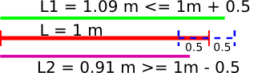
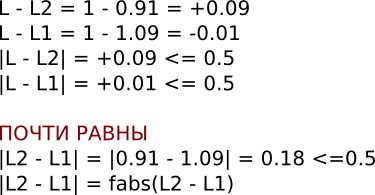

# sum_00

## Вся арифметика
Распечатайте сумму двух целых чисел

## Входные данные
Два целых числа, по модулю меньших 3000, через пробел

## Выходные данные
Сумма чисел

## Примеры
Вход|Выход
---|---
17 5|22

## [Решение](sum_00.java)

---

# sum_1

## Паспорт Кащея
Кащей Бессмертный родился в N-том году, а паспорт получил только в K-том году. Сколько лет Кащей Бессмертный прожил без паспорта?

## Входные данные
N и K - два целых положительных числа, меньших 3000

## Выходные данные
Количество лет, прожитых Кащеем без паспорта.

## Примеры
Вход|Выход
---|---
1000 1970|970

## [Решение](sum_1.java)

---

# sum_2

## Возраст невесты Кащея
Когда Василисе Премудрой исполнилось 18 лет, Кащей Бессмертный решил взять ее замуж. Василиса спросила, сколько у Кащея сундуков с золотом. Кащей сказал, что у него K сундуков полных, и каждый год прибавляется еще по 33 сундука. Василиса обещала выйти за Кащея тогда, когда у него будет N сундуков, полных золота. Сколько полных лет будет невесте Кащея в день свадьбы?

Когда человеку 27 лет и 10 месяцев, то ему 27 полных лет.

## Входные данные
K и N - два целых положительных числа, меньших 100000

## Выходные данные
Возраст невесты Кащея, целое число.

## Примеры
Вход|Выход
---|---
27360 30000|98

## [Решение](sum_2.java)

---

# sum_3

## Конец K-ого урока
В школе продолжительность каждого урока 45 минут, а перемены между уроками – всего 5 минут. Первый урок начинается ровно в 8 часов утра. Напишите программу, отвечающую на вопрос "во сколько в этой школе заканчивается K-ый урок?"

## Входные данные
Натуральное число K, не превышающее 15

## Выходные данные
Выведите время окончания K-ого урока: hh:mm (с лидирующими нулями).

## Примеры
Вход|Выход
---|---
1|08:45
5|12:05

## [Решение](sum_3.java)

---

# if_1

## Min: МИНИМУМ ИЗ 2 ЧИСЕЛ
Найдите минимум из двух целых чисел.

## Входные данные
Два целых числа. Числа по модулю меньше 30000

## Выходные данные
Минимальное из этих чисел

## Примеры
Вход|Выход
---|---
1 23|1
1 -23|-23

## [Решение](if_1.java)

---

# if_3

## Принадлежит множеству
Найдите, принадлежит ли введенное целое число множеству [-25; 37)

## Входные данные
Целое число по модулю меньше 30000

## Выходные данные
YES или NO

## Примеры
Вход|Выход
---|---
-123|NO
15|YES

## [Решение](if_3.java)

---

# if_4

## Принадлежит объединению множеств
Найдите, принадлежит ли введенное целое число объединению множеств (-∞; 37) U [146; ∞)

## Входные данные
Целое число по модулю меньше 30000

## Выходные данные
YES или NO

## Примеры
Вход|Выход
---|---
-123|YES
115|NO
155|YES

## [Решение](if_4.java)

---

# if_10eps

## Почти равны

Обычные числа нельзя сравнить точно. Можно только сказать, что они "ПОЧТИ РАВНЫ" или "НЕ РАВНЫ"

Для этого мы используем **точность**. Например, точность **eps=0.5**. Сравним длины. Почти 1 метр.





Длина - в метрах (обычные числа **float**). Напечатать **YES**, если числа ПОЧТИ РАВНЫ и **NO**, если не равны.

**Точность eps=0.1**

## Входные данные
Два числа через пробел

## Выходные данные
Текст "YES" или "NO"

## Примеры
Вход|Выход
---|---
3.142 3.141|YES
3.1 4.2|NO

## [Решение](if_10eps.java)

---

# for_1

## Сумма чисел
Найдите сумму чисел.

## Входные данные
Целое число 0 < N < 8. Затем N чисел, сумму которых необходимо вычислить, модуль чисел не превосходит 1024.

## Выходные данные
Сумма чисел

## Примеры
Вход|Выход
---|---
3<br>1 2 1|4
2<br>5 2|7

## [Решение](for_1.java)

---

# for_3

## Только нечетные
Напишите программу, которая считывает целые числа и печатает из них только нечетные, не изменяя порядок следования чисел.

## Входные данные
Натуральное число N < 100. Далее N чисел по модулю не превышающих 30000.

## Выходные данные
Только нечетные числа

## Примеры
Вход|Выход
---|---
3<br>7 2 1|7 1
4<br>5 12 5 4|5 5

## [Решение](for_3.java)

---

# Big

## Первые 10 цифр от суммы N 50-значных чисел
Найдите первые 10 цифр суммы нескольких 50-значных чисел.

## Входные данные
На первой строке количество слагаемых 2 ≤ N ≤ 100. Далее по одному 50-значному слагаемому на строку. В конце каждой строки возможно некоторое количество пробельных символов.

## Выходные данные
Первые 10 цифр суммы

## Примеры
Вход|Выход
---|---
2<br>74324986199524741059474233309513058123726617309629<br>91942213363574161572522430563301811072406154908250|1662671995

## [Решение](Big.java)

---

# 1scanner_avr

## avr
Напечатать среднее арифметическое введенных целых чисел.
Среднее арифметическое чисел a1, a2, ..an считается по формуле (a1+a2+..an)/n.

**Вычисление суммы произвольного количества целых чисел.**
```java
import java.util.Scanner;

class Main {
    public static void main(String args[]) {
        Scanner s = new Scanner(System.in);
        int sum = 0;
        while (s.hasNextInt()) {
            sum += s.nextInt();
        }
        System.out.println(sum);
    }
}
```

## Входные данные
1 или более целых чисел, сумма которых умещается в int.

## Выходные данные
Среднее арифметическое этих чисел

## Примеры
Вход|Выход
---|---
2 3 1 4|2.5

## [Решение](1scanner_avr.java)

---

# 2time

## Time.print
Таймер для измерения времени показывает часы и минуты.

```java
class Time {
  public int hour;  // часы
  public int min;   // минуты
  // тут будут методы класса
}
```

Написать метод **void print()**, которая печатает время таймера через двоеточие.

Написать метод **public static void main(String args[])** (см. пример).

```java
import java.util.Scanner;

class Time {
    public int hour; // поле hour (часы)
    public int min; // поле min (минуты)

    public void print() {
        // тут надо написать код
    }

    public static void main(String args[]) {
        Scanner s = new Scanner(System.in);
        Time t = new Time(); // создали объект типа Time и записали ссылку на него в t
        t.hour = s.nextInt(); // записали прочитанное число в поле hour по ссылке t
        t.min = s.nextInt(); // записали прочитанное число в поле min по ссылке t
        t.print(); // вызвали метод print по ссылке t
    }
}

// класс Main нужен, чтобы проверяющая система могла проверить код
class Main {
    public static void main(String args[]) {
        // вызываем метод main класса Time
        // метод статический, поэтому можно обойтись без создания объекта,
        // вызвав метод по имени класса
        Time.main(args);
    }
}
```

Написать и отладить программу.

## Входные данные
2 числа через пробел

## Выходные данные
Время через :

## Примеры
Вход|Выход
---|---
12 50|12:50

## [Решение](2time.java)

---

# 1coord

## Coord.length
Каждая точка задана координатами на плоскости (x,y) - целые числа. Даны две точки на плоскости. Нужно вычислить расстояние между этими точками.

```java
class Coord{
    public int x;
    public int y;
    // здесь будут методы класса
}
```

Написать методы:
**void read(Scanner s)**, которая получает координаты точки.<br>
**void print()**, которая печатает координаты точки.<br>
**double length(Coord a)**, которая вычисляет расстояние до точки a.<br>или<br>
**static double length(Coord a, Coord b)**, которая вычисляет расстояние между точками a и b.

Для вычисления квадратного корня, воспользуйтесь методом **double Math.sqrt(double d)**

```java
import java.util.Scanner;

class Coord {
    public int x;
    public int y;

    public void print() {
        // (x,y)
        System.out.println("(" + x + "," + y + ")");
    }

    void read(Scanner s) {
        // здесь нужно написать код
    }

    double length(Coord a) {
        // здесь нужно написать код
    }

    static double length(Coord a, Coord b) {
        // здесь нужно написать код
    }

    public static void main(String args[]) {
        Scanner s = new Scanner(System.in);
        Coord t1 = new Coord();
        Coord t2 = new Coord();

        // получить координаты с помощью метода read

        // при отладке программы удобно их напечатать
        // t1.print();
        // t2.print();

        double res;
        // можно считать длину методом объекта
        res = t1.length(t2);
        System.out.println(res);

        // или статическим методом класса
        res = Coord.length(t1, t2);
        System.out.println(res);
    }
}

// Проверяющая система запускает сначала класс Main
class Main {
    public static void main(String args[]) {
        Coord.main(args);
    }
}
```

Написать и отладить программу.

## Входные данные
4 числа через пробел: x y координаты первой точки, x y координаты второй точки

## Выходные данные
Расстояние между точками.

## Примеры
Вход|Выход
---|---
0 3 4 0|5.0

## [Решение](1coord.java)

---

# 2coord

## Line.move
Каждая точка задана координатами на плоскости (x,y) - целые числа. Даны две точки на плоскости - это отрезок. Нужно переместить отреок вдоль оси х на расстояние x и напечатать его координаты.

```java
class Coord{
    public int x;
    public int y;
    // методы класса Coord
}

class Line{
    public Coord start, finish;   // Точки начала и конца отрезка
    // методы класса Line
};
```

Написать функции класса Coord.
Написать функции класса Line (можно написать еще функции в этом классе, если нужно):

Функция|Что делает
---|---
Line(Coord a, Coord b)|конструкор отрезка из 2 точек
Line(Scanner s)|Дополнительная задача: попробуйте переписать решение через этот конструкор отрезка
void print()|печатает координаты концов отрезка через пробел.
void move(int dx)|перемещает отрезок вдоль оси x на расстояние dх.

```java
import java.util.Scanner;

class Main {
    public static void main(String args[]) {
        Line.main(args);
    }
}

class Coord {
    public int x;
    public int y;

    void print() {
        // x y через пробел
        System.out.print(x + " " + y + " ");
    }

    void read(Scanner s) {
        x = s.nextInt();
        y = s.nextInt();
    }
}

class Line {
    public Coord start;
    public Coord finish;

    Line(Coord a, Coord b) {
        start = a;
        // здесь нужно дописать код
    }

    void print() {
        start.print();
        // здесь нужно дописать код
    }

    void move(int dx) {
        // здесь нужно дописать код
    }

    public static void main(String args[]) {
        Scanner s = new Scanner(System.in);
        Coord a = new Coord();
        Coord b = new Coord();
        a.read(s);
        b.read(s);
        Line lin = new Line(a, b);

        int dx = s.nextInt();
        lin.move(dx);

        lin.print();
    }
}
```

Написать и отладить программу.

## Входные данные
5 целых чисел через пробел: x y координаты первой точки, x y координаты второй точки, на сколько сдвинуть вдоль оси х.

## Выходные данные
Координаты начала и конца отрезка после сдвига.

## Примеры
Вход|Выход
---|---
0 3 4 0 2|2 3 6 0

## [Решение](2coord.java)

---

# Задача B
Напишите статический класс summator с публичными целыми членами A,B,Sum и функцией public int calculate();
Функция calculate вычисляет сумму.

## Примеры
Вход|Выход
---|---
1 2|3

## [Решение](B.java)

---

# Задача C
Напишите статический класс summator с приватными членами A,B,Sum и функциями calculate, set_a, set_b

## Примеры
Вход|Выход
---|---
1 2|3

## [Решение](C.java)

---

# Задача D
Напишите статический класс summator с приватными членами A,B,Sum и функциями calculate, set_a, set_b, которые могут работать как с целыми, так и с действительными числами. Действительное число возвращает getSum(), целое - calculate().

## Примеры
Вход|Выход
---|---
1 2|3

## [Решение](D.java)

---