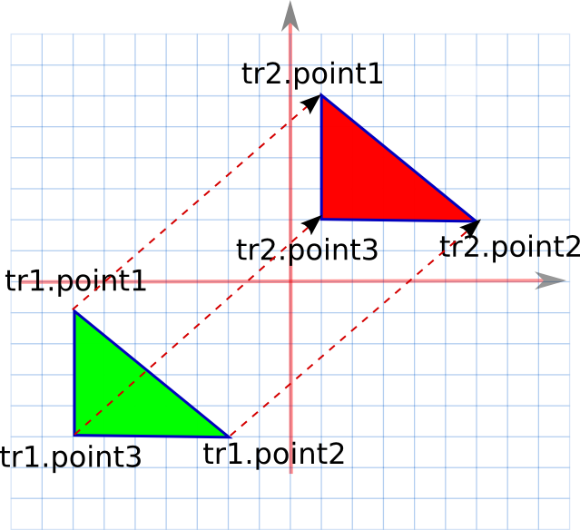

# class-1

## Alarm
Таймер для измерения времени показывает часы и минуты.

```cpp
class Time{
  public:
   int hour;
   int min;
};
```

Написать функцию **Time add(Time a, int min)**, которая увеличивает время таймера на число минут **min** и возвращает время, которое будет показывать таймер.

```cpp
/*
  В начале программы директивы препроцессора
*/
// Начало мантры

#include <iostream>
#include <cstdlib>
#include <math.h>
using namespace std;
// Конец директив и выбора пространства имён

class Time{
  public:
   int hour;
   int min;
};

Time add(Time a, int min) {
    // Здесь нужно написать код
}

int main() {
    Time a,newtime;
    int min;

    // Получить a  из консоли
    cin>>a.hour>>a.min;

    // Получить min  из консоли
    cin>>min;

    newtime = add(a,min);
    cout << newtime.hour << ":" << newtime.min << endl;
}
```

Написать и отладить программу.

## Входные данные
3 числа через пробел

## Выходные данные
Сумма показаний таймера и минут через :

## Примеры

Вход|Выход
---|---
12 50 30|13:20
12 50 720|0:50

## [Решение](class-1.cpp)

---

# class-2

## Таймер 2
Таймер для измерения времени показывает часы и минуты. Таймер запустили в 0 часов, 0 минут.

```cpp
class Time{
  public:
   int hour;
   int min;
};
```
Написать функцию **int isEqual(Time a, int min)**, которая сравнивает время таймера с момента запуска и число минут **min** и возвращает 1, если число минут с момента запуска равно **min**, если не равны - возвращает 0.

```cpp
/*
Эту часть сдавать НЕ надо. Она будет вставлена ПЕРЕД Вашим кодом.
*/

#include <iostream>
#include <cstdlib>
#include <math.h>
using namespace std;

class Time{
  public:
   int hour;
   int min;
};

/*
А вот здесь начинается Ваша функция, которую Вы сдаёте:
*/

int isEqual(Time a, int min) {
    // Здесь нужно написать код
}

/*
Здесь Ваша функция кончается. Для удобства отладки приведено то, что будет вставлено ПОСЛЕ  Вашего кода.
*/


int main() {
    Time a,newtime;
    int min;
    int res;

    // Получить a  из консоли
    cin>>a.hour>>a.min;

    // Получить min  из консоли
    cin>>min;

    res = isEqual(a,min);
    cout <<res<< endl;
}
```

Написать и отладить ТОЛЬКО ФУНКЦИЮ

## Входные данные
АРГУМЕНТЫ ФУНКЦИИ

## Выходные данные
КОД ВОЗВРАТА ФУНКЦИИ

## Примеры

Вход|Выход
---|---
0 50 50|1
1 50 120|0

## [Решение](class-2.cpp)

---

# class-3

## Линейка 1
На линейке отмечены сантиметры и миллиметры.
Сантиметров на линейке не больше 300.
Лист бумаги в клетку.
2 клетки = 1 см.

Линейка описывается классом:

```cpp
class Lin{
  public:
   int cm; // сантиметры
   int mm; // миллиметры
};
```

С помощью линейки измеряют расстояния.

Написать функции:

Функция|Что делает
---|---
void printLin(Lin a)|печатает длину в сантиметрах и миллиметрах.
Lin convertToLin(int kletki)|вычисляет размер листа бумаги в сантиметрах и миллиметрах. Лист бумаги измерен в клеточках.

Написать и отладить программу. В систему отправить только указанные функции **printLin** и **convertToLin**.
Класс Lin и функцию main отправлять в систему НЕ нужно.
Вводить с экрана ничего НЕ нужно.

## Входные данные
Размер листа в клеточках.

## Примеры

Вход|Выход
---|---
25|12 5

## [Решение](class-3.cpp)

---

# class-4

## Прямоугольник и квадрат
Треугольник задан координатами своих вершин.



Треугольник a равен треугольнику b, если его можно переместить, при необходимости повернуть и наложить на треугольник b.

```cpp
class Coord{
  public:
   int x;
   int y;
};

// Класс треугольник
class Triangle{
public:
  Coord p1,p2,p3;
};
```

Написать функции:

Функция|Что делает
---|---
void getTri(Triangle& tri)|получает данные треугольника, т.е. считывает со стандартного потока ввода координаты вершин треугольника, заполняет структуру Triangle и возвращает её через tri
Coord getPoint()|вспомогательная функция - считывает со стандартного потока ввода координаты точки и возвращает их через класс Coord.
int cmp(Triangle a, Triangle b)|сравнивает треугольник a с b. Если они равны, возвращает 1, если нет, возвращает 0.

Написать и отладить **ФУНКЦИИ**. В систему отправить только указанные функции **getTri**, **cmp** и, может быть, **getPoint**.
Классы Coord и Triangle и функцию main отправлять в систему НЕ нужно.
Выводить на экран ничего НЕ нужно.

## Входные данные
координаты вершин двух треугольников (первые два числа - координаты первой точки первого треугольника, следующие два числа - координаты второй точки первого треугольника и т.д.)

## Выходные данные
результат cmp

## Примеры

Вход|Выход
---|---
0 0 3 0 0 4 1 1 4 1 1 5|1
10 0 10 3 14 0 -5 -1 -1 -1 -1 -5|0
10 0 10 3 14 0 -5 -1 -1 -1 -1 -4|1

## [Решение](class-4.cpp)

---

# Complex
Написать класс комплексных чисел C.

У класса должны быть доступны члены класса re и im, а так же метод double abs, который возвращает модуль комплексного числа.

Определить конструкторы:
1) от пары чисел типа double;
2) одного числа типа double (действительной части);
3) конструктор копирования - от одного комплексного числа типа C.

Определить для класса арифметические операции (+, -, *, /, ==, !=), а также операции между комплексными и действительными числами (в том числе и для случая, когда действительное число является левым операндом).

Определить оператор потокового вывода, комплексное число выводить в формате двух действительных чисел, разделённых пробелом (действительная часть вначале).

Функция main() находится в коде Заказчика, её вызывать НЕ надо.

## [Решение](complex.cpp)

---

# Matrix
Реализовать класс Matrix.

Публичные поля:
- rows - количество строк
- columns - количество столбцов
- double *data - данные матрицы (лежат в динамически выделенной памяти, к ним должен быть прямой доступ, данные лежат по строкам).

В том числе реализовать:
- конструктор Matrix(int rows, int columns)

При недопустимом значении количества строк и столбцов выводить в стандартный поток вывода текст "Wrong size of matrix" и завершать всю программу с кодом возврата 1.

- конструктор копирования
- оператор << // возвращает матрицу по строкам

1 2 3<br>4 5 6

Элементы одной строки разделены символом пробела. В конце каждой строки стоит символ перевода строки. Данные хранятся в памяти в виде массива, память под него выделяется динамически, построчно, т.е. сначала идут элементы первой строки, затем элементы второй строки и т.д.

Файл нужно отправлять без функции main, заголовочные файлы не нужны.
Вводом и выводом данных занимается код Заказчика.

## [Решение](matrix.cpp)

---

# sum-sum by templates

## Сумма
Написать функцию суммы двух чисел, используя шаблоны:

\<result\> **summ_of_numbers**(\<first_number\>, \<second_number\>)

## [Решение](sum.cpp)

---

# povtor-Уникальные числа
Необходимо выяснить количество неповторяющихся чисел в последовательности.

## Входные данные
В первой строке подается натуральное n - количество чисел в последовательности. В следующей строке подается n целых чисел.

## Выходные данные
Натуральное число - количество РАЗЛИЧНЫХ чисел в последовательности.

## Примеры

Ввод|Вывод
---|---
6<br>2 2 2 3 3 4|3
2<br>1 1|1

## [Решение](povtor.cpp)

---

# popular-Самoе популярое слово
Найти самое популярное слово из данных без учёта регистра и найти количество его вхождений.

## Входные данные
На первой строке n (0 < n <= 1000) — количество слов. Далее n строк, которые являются данными словами (вся строка является словом, пробелов нет).

## Выходные данные
Через пробел искомое слово в нижнем регистре и количество его вхождений.

## Примеры
Ввод|Вывод
---|---
3<br>Aa<br>aa<br>Aaa|aa 2
4<br>AaA<br>aAa<br>AAA<br>Aba|aaa 3

## [Решение](popular.cpp)

---
