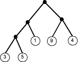

# gate - Межзвёздные Врата

## Капитан Гоаулд
С помощью программы, которую Вы писали в предыдущей задаче, удалось выяснить, что капитан межзвёздных пиратов Гоаулд в прошлое посещение Земли зарыл на острове Валаам ценнейший артефакт - Межзвёздные врата. Он оставил описание, как найти клад. Описание состоит из строк вида: “North 5”, где первое слово – одно из “North”, “South”, “East”, “West”, а второе число – количество шагов, необходимое пройти в этом направлении.

Напишите программу, которая по описанию пути к кладу определяет точные координаты клада, считая, что начало координат находится в начале пути, ось OX направлена на восток, ось OY – на север.

Программа получает на вход последовательность строк указанного вида, завершающуюся строкой со словом “Treasure!”. Программа должна вывести два целых числа: координаты клада.

## Примеры

Вход|Выход
---|---
North 5 East 3 South 1 Treasure!|3 4

## [Решение](gate.c)

---

# invertor

## Переворачивание слов
В Альдебаранском языке предложение пишется слева направо, а вот слова - справа налево. Напишите программу, которая переворачивает все слова в строке. Границей слова является граница между латинскими и нелатинскими символами.

## Входные данные
Одна строка, завершающаяся символом конца строки '\n'. Длина строки менее 1000.

## Выходные данные
Та же самая строка, только все слова должны быть «перевернуты». Символы, отличные от латинских букв должны остаться на своих местах.

## Примеры
Вход|Выход
---|---
Answer to Life, the Universe, and Everything!|rewsnA ot efiL, eht esrevinU, dna gnihtyrevE!

## [Решение](invertor.c)

---

# tree

## Случайный спуск по дереву
На вход подается описание бинарного дерева. На листьях (висячих вершинах) этого дерева написаны целые числа (от -10^6 до 10^6). Идем от корня дерева, случайно поварачивая направо или налево (с вероятностями 0.5).

Чему равно cреднее значение числа на листе, в который мы в конечном счете придем? Ответ вывести с точностью до двух знаков после запятой.

Число вершин дерева < 1000

Формат описания дерева следующий: 
tree ::= leaf | (tree tree); leaf ::= integer;

Например: 
(((3 5) 1) (9 4))

## Примеры
Вход|Выход
---|---
(((3 5) 1) (9 4))|4.50

## [Решение](tree.c)

---

# brackets

## Сложные [к()б()чки
Пусть скобочные структуры состоят из четырех различных пар скобок: () [] {} <>
Открывающая и закрывающая скобки должны быть одного типа.
Ваша задача - определить правильная ли скобочная структура.

## Входные данные
Последовательность указанных скобок; размер входных данных не превосходит 100Кб.

## Выходные данные
YES в случае если структура правильная и NO, если неправильная.

## Примеры
Вход|Выход
---|---
{)|NO
[({<>})]|YES
\><|NO

## [Решение](brackets.c)

---